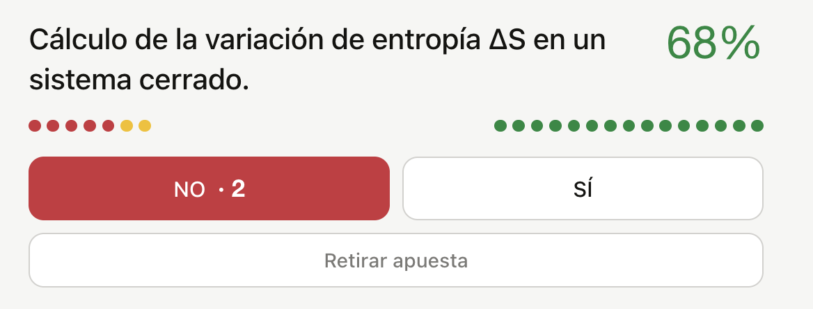
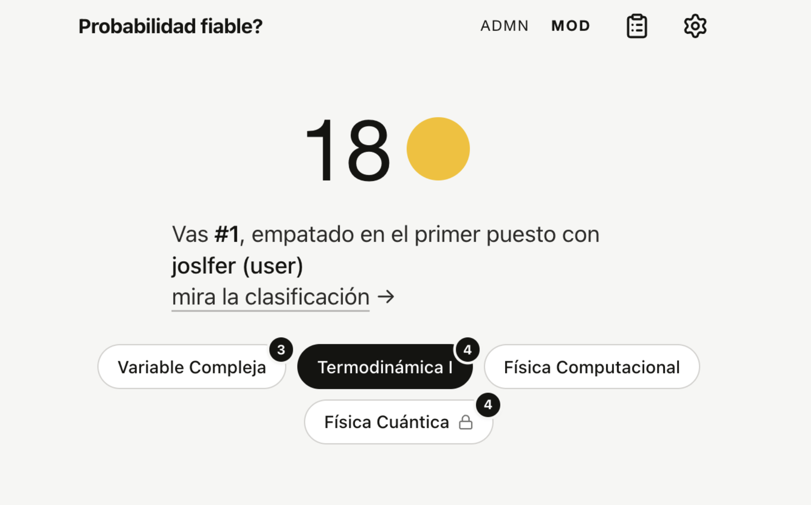

# casandra: Mercado de predicción para preguntas de exámenes. 

Casandra permite a una clase entera consultar y apostar sobre qué puede entrar en un examen. 

Los compañeros apuestan tokens 🟡 al SÍ o NO según si creen que algo va a caer en el examen, calculando entre todos una probabilidad %. Se obtiene una opinión agreagada.

Pasado el examen, los que acertaron se llevan los tokens de los perdedores. (ficticios)

El objetivo es cada vez adivinar mejor qué va a entrar, y dar una herramienta divertida y útil a las personas para estudiar.

Inspirado por este vídeo de YouTube de Art of the Problem 
https://youtu.be/ngX1nIvnMOM?si=XHRu2Ssn6lsuC7c3

Para leer más sobre prediction marekts: 
https://gwern.net/prediction-market

